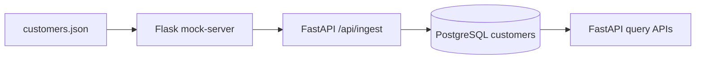

# Customer Pipeline Project 🚀

A backend project with 3 services working together in one ingestion pipeline:

- `mock-server` (Flask): serves customer data from JSON
- `pipeline-service` (FastAPI): ingests + serves DB-backed API
- `postgres` (PostgreSQL): stores customer records

---

## Table of Contents

- [1. Architecture](#1-architecture-)
- [2. Project Structure](#2-project-structure-%EF%B8%8F)
- [3. Environment Configuration](#3-environment-configuration-%EF%B8%8F)
- [4. Run with Docker (Recommended)](#4-run-with-docker-recommended-)
- [5. Run without Docker (uv)](#5-run-without-docker-uv-)
- [6. API Summary](#6-api-summary-)
- [7. Database Schema & Migration](#7-database-schema--migration-%EF%B8%8F)
- [8. Testing](#8-testing-)
- [9. Troubleshooting](#9-troubleshooting-)
- [10. Credits](#10-credits-)

---

## 1. Architecture 🧱

How data moves through services and how the code is organized internally.

### Data Flow 🔄



### Design approach 🧠

The code uses lightweight layered design (no over-engineering):

- Controller: request/response handling (`main.py`, `app.py`)
- Service: business logic (`services/ingestion.py`)
- Repository: persistence queries (`CustomerRepository`)
- Model/Schema: DB model + API contracts (`models/`, `schemas/`)
- Infrastructure: DB and migration runner (`database.py`)


---

## 2. Project Structure 🗂️

High-level folder layout so you can navigate the project quickly.

```text
.
├── docker-compose.yml
├── Makefile
├── .env
├── .env-example
├── README.md
├── TEST_CASES.md
├── mock-server/
│   ├── app.py
│   ├── data/customers.json
│   ├── Dockerfile
│   └── requirements.txt
└── pipeline-service/
    ├── config.py
    ├── database.py
    ├── main.py
    ├── migrations/001_create_customers_table.sql
    ├── models/customer.py
    ├── schemas/customer.py
    ├── services/ingestion.py
    ├── Dockerfile
    └── requirements.txt
```


---

## 3. Environment Configuration ⚙️

Single place to understand which env vars are needed and where they are used.

Copy template once if needed:

```bash
cp .env-example .env
```

Services auto-read environment values from:

1. project root `.env`
2. service-local `.env` (if present)

### Important variables 📌

| Variable | Example | Used by | Notes |
|---|---|---|---|
| `POSTGRES_USER` | `postgres` | postgres, pipeline | DB auth |
| `POSTGRES_PASSWORD` | `password` | postgres, pipeline | DB auth |
| `POSTGRES_DB` | `customer_db` | postgres, pipeline | DB name |
| `POSTGRES_PORT` | `5432` | docker/local | Host port mapping (`5432 -> 5432`) |
| `MOCK_SERVER_URL` | `http://localhost:5000` | pipeline | Connect to mock server |
| `APP_HOST` | `0.0.0.0` | pipeline-service | Bind host |
| `APP_PORT` | `8000` | pipeline-service | Exposed API port |
| `INGEST_PAGE_SIZE` | `10` | pipeline-service | Pagination size for ingestion |
| `POSTGRES_HOST` | `localhost` | local run | For non-Docker mode |
| `MOCK_SERVER_HOST` | `0.0.0.0` | mock-server | Bind host |
| `MOCK_SERVER_PORT` | `5000` | mock-server | Exposed API port |

Notes:

- Docker mode: `DATABASE_URL` is injected by compose using service host `postgres:5432`.
- Local mode: `DATABASE_URL` resolves from env with `POSTGRES_HOST=localhost`.


---

## 4. Run with Docker (Recommended) 🐳

Fastest way to run everything with consistent environments.
Use this mode if you want the simplest setup.

### Quick start ⚡

```bash
make up
```

Or:

```bash
docker compose up --build
```

Do not run Docker and local mode at the same time.

### Verify ✅

```bash
make health
make ingest
make test-api
```

Expected ingest response:

```json
{"status":"success","records_processed":24}
```

### Useful Docker commands 🛠️

```bash
make logs
make down
```


---

## 5. Run without Docker (uv) 💻

Use this when you want to run each service manually for local debugging.
Use this mode only if local PostgreSQL is already installed and running.

Prerequisite: local PostgreSQL is running and database exists.

```sql
CREATE DATABASE customer_db;
```

### Terminal A: mock-server 🌐

```bash
make local-setup-mock
make local-run-mock
```

Expected: mock server listening on `http://localhost:${MOCK_SERVER_PORT}`.

### Terminal B: pipeline-service 🚚

```bash
make local-setup-pipeline
make local-run-pipeline
```

Expected: pipeline service listening on `http://localhost:${APP_PORT}`.

### Test local flow 🧪

```bash
make local-test-api
```

Expected ingest response:

```json
{"status":"success","records_processed":24}
```


---

## 6. API Summary 📘

Quick endpoint reference for both services.

### mock-server 🎭

| Method | Endpoint | Purpose |
|---|---|---|
| GET | `/api/health` | Health check |
| GET | `/api/customers?page=&limit=` | Paginated customers from JSON |
| GET | `/api/customers/{id}` | Single customer from JSON |

### pipeline-service ⚡

| Method | Endpoint | Purpose |
|---|---|---|
| GET | `/api/health` | Health check |
| POST | `/api/ingest` | Fetch from Flask + upsert to PostgreSQL |
| GET | `/api/customers?page=&limit=` | Paginated customers from DB |
| GET | `/api/customers/{id}` | Single customer from DB |

Detailed request/response examples are in [TEST_CASES.md](TEST_CASES.md).


---

## 7. Database Schema & Migration 🗄️

Table definition and migration behavior used by the pipeline.

Table: `customers`

- `customer_id VARCHAR(50) PRIMARY KEY`
- `first_name VARCHAR(100) NOT NULL`
- `last_name VARCHAR(100) NOT NULL`
- `email VARCHAR(255) NOT NULL`
- `phone VARCHAR(20)`
- `address TEXT`
- `date_of_birth DATE`
- `account_balance DECIMAL(15,2)`
- `created_at TIMESTAMP`

Migration file:

- `pipeline-service/migrations/001_create_customers_table.sql`

Migrations run automatically on pipeline startup.


---

## 8. Testing ✅

How to validate the whole flow quickly and where detailed test cases live.

- Manual API test cases and execution log: [TEST_CASES.md](TEST_CASES.md)
- Quick smoke tests via Makefile:

```bash
make health
make ingest
make test-api
```

### Latest test results (2026-03-08)

- Total test cases executed: `12`
- Passed: `12`
- Failed: `0`
- Status: `ALL PASS`

Detailed per-case results and actual responses:

- [TEST_CASES.md](TEST_CASES.md)


---

## 9. Troubleshooting 🆘

Common runtime issues and the fastest fix for each.

### Pipeline cannot connect to Postgres in Docker ❌

- Ensure compose uses container DB port `5432` internally.
- Host mapping can stay `POSTGRES_PORT=5432`.
- Restart clean:

```bash
docker compose down -v
docker compose up --build
```

### Ingest returns upstream error (`502`) ⚠️

- Check mock-server is running.
- Verify `MOCK_SERVER_PORT` and `MOCK_SERVER_URL` configuration.

### Local run fails with missing package 📦

- Reinstall deps in each venv:

```bash
cd mock-server && . .venv/bin/activate && uv pip install -r requirements.txt
cd ../pipeline-service && . .venv/bin/activate && uv pip install -r requirements.txt
```


---

## 10. Credits 🙌

Copyright © 2026 **Rizqi Wijaya**

[](https://www.linkedin.com/in/rizwijaya/)
[](https://github.com/rizwijaya)
